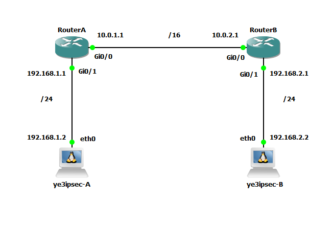

# GNS3

To run through GNS3, download and import the appliance : [ye3ipsec.gns3a](https://raw.githubusercontent.com/palw3ey/ye3ipsec/master/misc/ye3ipsec.gns3a)

## How to connect the docker container in the GNS3 topology ?
Drag and drop the device in the topology. Right click on the device and select "Edit config".  
If you want a static configuration, uncomment the lines just below `# Static config for eth0` or otherwise `# DHCP config for eth0` for a dhcp configuration. Click "Save".  
Add a link to connect the device to a switch or router. Finally, right click on the device, select "Start".  
To see the output, right click "Console".  
To type commands, right click "Auxiliary console".  

## Example

Site to site PSK connections



## Start the Cisco routers
Right click on the routers > Start

## Configure Cisco routers
Double click on the cisco router, copy paste :

- RouterA
```plaintext
enable
configure terminal

hostname RouterA

! wan
interface g0/0
ip address 10.0.1.1 255.255.0.0
ip nat outside
no shutdown
exit

! lan
interface g0/1
ip address 192.168.1.1 255.255.255.0
ip nat inside
no shutdown
exit

! nat
ip nat pool MYPOOL 10.0.1.1 10.0.1.1 netmask 255.255.255.0
access-list 1 permit 192.168.1.0 0.0.0.255
ip nat inside source list 1 pool MYPOOL overload

! port forward
ip nat inside source static udp 192.168.1.2 500 10.0.1.1 500
ip nat inside source static udp 192.168.1.2 4500 10.0.1.1 4500

! site to site route, through vpn
ip route 192.168.2.0 255.255.255.0 192.168.1.2

do copy running-config startup-config
```

- RouterB
```plaintext
enable
configure terminal

hostname RouterB

! wan
interface g0/0
ip address 10.0.2.1 255.255.0.0
ip nat outside
no shutdown
exit

! lan
interface g0/1
ip address 192.168.2.1 255.255.255.0
ip nat inside
no shutdown
exit

! nat
ip nat pool MYPOOL 10.0.2.1 10.0.2.1 netmask 255.255.255.0
access-list 1 permit 192.168.2.0 0.0.0.255
ip nat inside source list 1 pool MYPOOL overload

! port forward
ip nat inside source static udp 192.168.2.2 500 10.0.2.1 500
ip nat inside source static udp 192.168.2.2 4500 10.0.2.1 4500

! site to site route, through vpn
ip route 192.168.1.0 255.255.255.0 192.168.2.2

do copy running-config startup-config
```

## Configure ye3ipsec, static IP address
Right click on your ye3ipsec device > Edi config, copy paste :

- ye3ipsec-A
```bash
auto eth0
iface eth0 inet static
	address 192.168.1.2
	netmask 255.255.255.0
	gateway 192.168.1.1
	up echo nameserver 192.168.1.1 > /etc/resolv.conf
```
- ye3ipsec-B
```bash
auto eth0
iface eth0 inet static
	address 192.168.2.2
	netmask 255.255.255.0
	gateway 192.168.2.1
	up echo nameserver 192.168.2.1 > /etc/resolv.conf
```

## Configure ye3ipsec, environment variables
Right click on your ye3ipsec device > Configure > General settings > Environment variables, copy paste :

- ye3ipsec-A
```bash
Y_S2S_PSK_ENABLE=yes
Y_S2S_PSK_REMOTE_ADDRS=10.0.2.1
Y_S2S_PSK_LOCAL_ID=192.168.1.2
Y_S2S_PSK_REMOTE_ID=192.168.2.2
Y_S2S_PSK_SECRET=StrongSecret
Y_S2S_PSK_LOCAL_TS=192.168.1.0/24
Y_S2S_PSK_REMOTE_TS=192.168.2.0/24
```

- ye3ipsec-B
```bash
Y_S2S_PSK_ENABLE=yes
Y_S2S_PSK_REMOTE_ADDRS=10.0.1.1
Y_S2S_PSK_LOCAL_ID=192.168.2.2
Y_S2S_PSK_REMOTE_ID=192.168.1.2
Y_S2S_PSK_SECRET=StrongSecret
Y_S2S_PSK_LOCAL_TS=192.168.2.0/24
Y_S2S_PSK_REMOTE_TS=192.168.1.0/24
```

## Start the ye3ipsec devices
Right click on the ye3ipsec devices > Start

## Verify

- ye3ipsec-B  
Right click on ye3ipsec-B device > Auxiliary console
```bash
# to show log
swanctl --log
```

- ye3ipsec-A  
Right click on ye3ipsec-A device > Auxiliary console
```bash
# ping ye3ipsec-B
ping 192.168.2.2

# show active connection
swanctl -l
```

- RouterA  
Double click on RouterA device 
```plaintext
do ping 192.168.2.2
```
